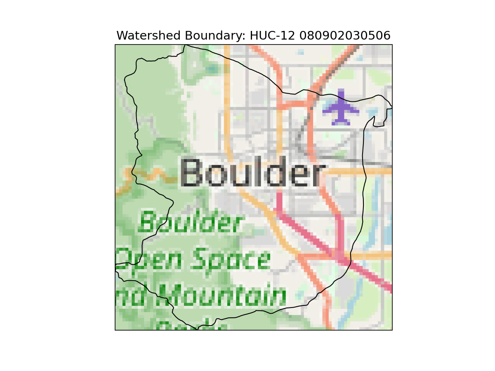
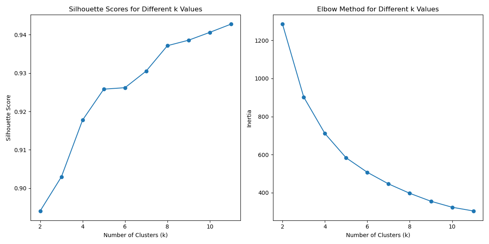
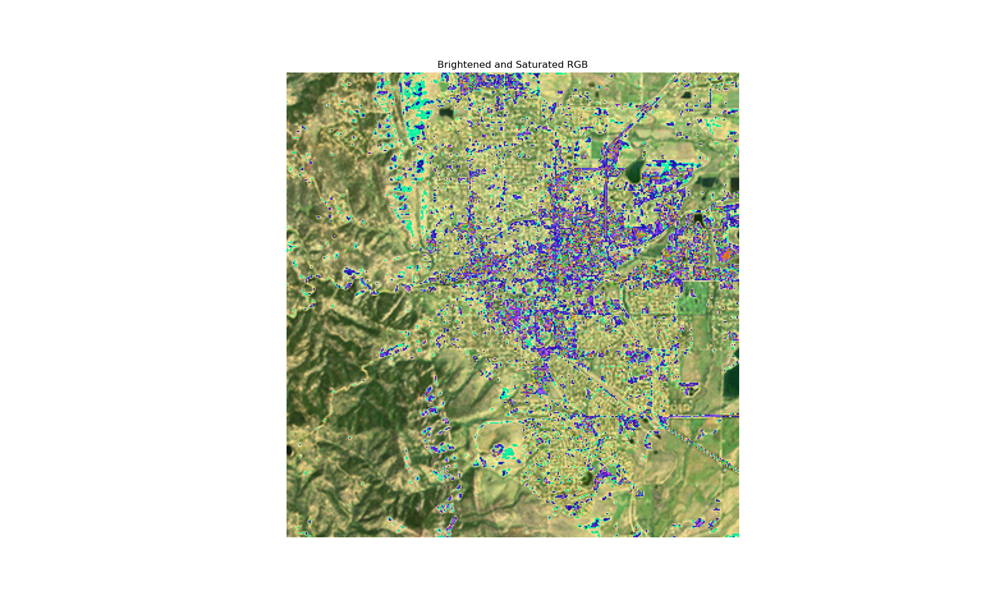
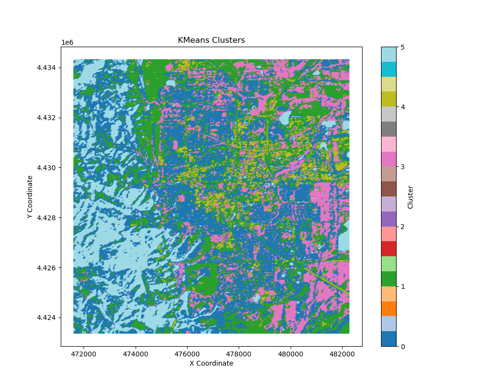

### SITE DESCRIPTION
For this assignment we downloaded the Water Boundary Dataset for region 10 located in Colorado (specifically watershed 101900050406). This watershed covers most of the city of Boulder, plus some of the foothills to the west of Boulder and some of the area south of Boulder. I wanted to pick something a little more Urban than the previous land classification assignment that practiced land classification on the Mississippi Delta. This area contains grasslands, creeks, pine forests, large rock formations, and urban environments. Please note that I was unable to figure out how to load in satellite imagery under my watershed boundary so I used OpenStreetMap (OSM)

  
#### Citations:  
Boulder, C. (n.d.). Ecology and ecosystems of the Boulder Creek watershed. Boulder Creek Watershed. https://bcn.boulder.co.us/basin/learning/ecology.html#:~:text=Ecosystems%20found%20in%20the%20Boulder,tundra%20and%20the%20aquatic%20ecosystem.

### SILHOUETTE AND ELBOW PLOTS

In order to help determine the number of clusters I wanted to use in my K means calculation I used a combination of the Elbow Method and a Silhouette Score. For the Elbow Method I calculated and plotted the within-cluster sum of squares (WCSS) or inertia, as it is know in the Sklearn package, against different values of K, and then visually identified the "elbow" on the plot where the rate of decrease sharply changes and begins to flatten out, which is somewhere around 6 or 7 clusters. For the Silhouette Score I looked for values that were closer to one, which represented a more dense and well-separated cluster. There seems to be a dip in the silhouette score at 4, which is interesting to see. However, they seemed to trail off closer and closer to 1 - so I went with 6 clusters in an attempt to get discrete land classification groups, while also trying not to over classify the data. 

### RGB AND CLUSTER PLOTS

  
  I plotted both the RGB color bands (after they had been brightened and saturated) and the K means clusters to see how they visually compared. It looks like the program was able to classify lakes well, as well as follow elevation changes, but the way it has classified urban areas is strange. It looks like it has classed different parts of Boulder neighborhoods as different clusters, when I think they should be classed as a single "building" class. I think having trained data or a more sophisticated classification model would work better. Also, I believe the unnatural bright colors present in the rgb image to be NaN values. I was able to drop the NaN values prior to classifying the K means clusters but I ran into some coding errors when trying to drop the NaN values from the RGB image.
